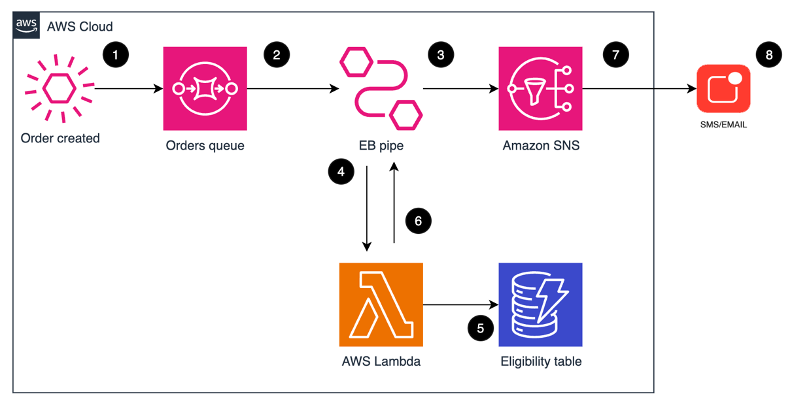

# Enriching and customizing notifications with Amazon EventBridge Pipes

This repository contains the code described on the AWS Compute Blog: [PLACEHOLDER].

The post describes a scenario where a clothing retailer wants to keep loyal customers engaged. To do so, the retailer wants to send targeted promotion codes. As soon as a 10th order is placed, the code is sent via email or SMS to their customer.

This is solved using [Amazon EventBridge Pipes](https://aws.amazon.com/fr/eventbridge/pipes/) with the following architecture:



1.	A customer orders a new item. The order is sent to a SQS orders queue. 
2.	The new message on the orders queue triggers the EventBridge Pipes.
3.	The pipe triggers an AWS Lambda function to enrich the data.
4.	The functions checks if the customer is eligible for a discount code against an Amazon DynamoDB table. The table contains the number of times each customer has ordered.
5.	The Lambda function returns the custom message that will be sent to the customer, either with or without the discount code.
6.	The message is routed to an SNS topic by the EventBridge Pipe
7.	Customer receives the notification via its preferred subscription method.


## Deploying the solution

This repository is using the [AWS CDK](https://aws.amazon.com/cdk/) in Python. 

> **_NOTE:_** This sample code should be used to test out the solution and is not intended to be used in production account.

Instructions on how to test this solution can be found on the blog.

### Prerequisistes

1.	The [AWS Command Line Interface (CLI)](https://aws.amazon.com/cli/) installed and [configured for use](https://docs.aws.amazon.com/cli/latest/userguide/cli-chap-configure.html).
2.	An [Identity and Access Management (IAM)](https://aws.amazon.com/iam/) role or user with enough permissions to create an IAM policy, DynamoDB table, SQS queue, SNS topic, Lambda Function and EventBridge Pipes.
3.	[AWS CDK](https://docs.aws.amazon.com/cdk/v2/guide/getting_started.html)
4.	[Python version 3.9](https://www.python.org/downloads/release/python-390/) or above, with [pip and virtual virtualenv](https://docs.aws.amazon.com/cdk/v2/guide/work-with-cdk-python.html#python-prerequisites).

### Deployment instructions

If this is your first time deploying a CDK Stack in your account, run:

```
cdk bootstrap
```

To deploy the stack, run:

```
cdk deploy
```

### Cleanup

The resources deployed in your account may incur some costs. To delete them, run:

```
cdk destroy
```